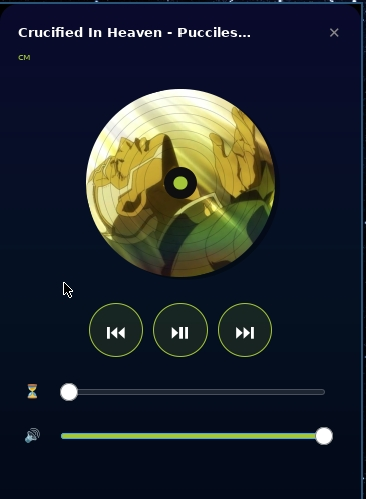

# PW-memu - player widget  menu

> A minimalist GTK widget for controlling your music player — and not only that.




-blue)


---

## Features

- Spinning disc with album art
- Track title and artist in real time
- Playback controls (previous, play/pause, next)
- Timeline with seeking
- Volume control
- Floating window mode with drag support
- Dark gradient background with rounded corners
- HTTP album art support (via curl + ffmpeg)

---

## Audio Driver Support

| Flag          | Driver          | Tool     |
|---------------|-----------------|----------|
| `--alsa`      | ALSA (default)  | `amixer` |
| `--pipewire`  | PipeWire        | `wpctl`  |
| `--pulse`     | PulseAudio      | `pactl`  |

---

## Dependencies


* Arch / Manjaro
```sh
pacman -S gtk3 cairo playerctl curl ffmpeg gcc pkg-config
```

* Gentoo
```sh
emerge gtk+:3 cairo playerctl curl ffmpeg gcc pkg-config
```
* Termux (Android)
```sh
pkg install clang pkg-config gtk3 cairo playerctl curl ffmpeg gcc
```
* Debian 
```sh
apt install build-essential pkg-config libgtk-3-dev libcairo2-dev libgdk-pixbuf-2.0-dev playerctl curl ffmpeg gcc
```
---

## Build

```bash
git clone https://github.com/kuzmak161-creator/PW-menu
cd PW-menu
make
```

Or manually:

```bash
g++ -o build/pw-menu player.cpp \
    $(pkg-config --cflags --libs gtk+-3.0 cairo) \
    -std=c++17 -pthread -O2
```

---

## Install

```bash
make install
```

Installs to:
- `/usr/local/bin` on Linux
- `$PREFIX/bin` on Android (Termux)

---

## Usage
* Default (ALSA)
```bash
pw-menu
```

* pipewire
```sh
pw-menu --pipewire
```
* PulseAudio
```sh
pw-menu --pulse
```
* floating window
```sh
pw-menu --swim
```

* Help
```sh
pw-menu --help
```

---

## i3blocks Integration

Add to `~/.config/i3blocks/config`:

```ini
[PW-menu]
command=~/.config/i3blocks/pw-menu_btn.sh
interval=2
color=#a4c639
```

Create `~/.config/i3blocks/pw-menu_btn.sh`:

```bash
#!/bin/bash
if [ "$BLOCK_BUTTON" = "1" ]; then
    if pgrep -x "pw-menu" > /dev/null; then
        pkill -x "pw-menu"
    else
        pw-menu &
    fi
fi

STATUS=$(playerctl status 2>/dev/null)
TITLE=$(playerctl metadata title 2>/dev/null | cut -c1-20)

if [ "$STATUS" = "Playing" ]; then
    echo "* $TITLE"
elif [ "$STATUS" = "Paused" ]; then
    echo "|| $TITLE"
else
    echo "[PW-menu]"
fi
```

```bash
chmod +x ~/.config/i3blocks/pw-menu_btn.sh
```

---

## Tested On

| Platform| architecture| Status |
|---------|-------------|--------|
| Termux  | aarch64     | works✅|
| Gentoo  | x86-64      | works✅|
| Debian  | aarch64     | works✅|

---

## License

MIT
